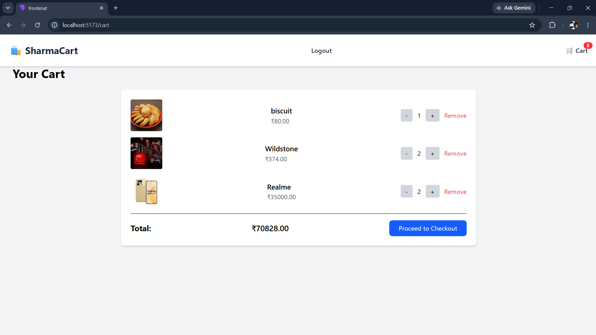
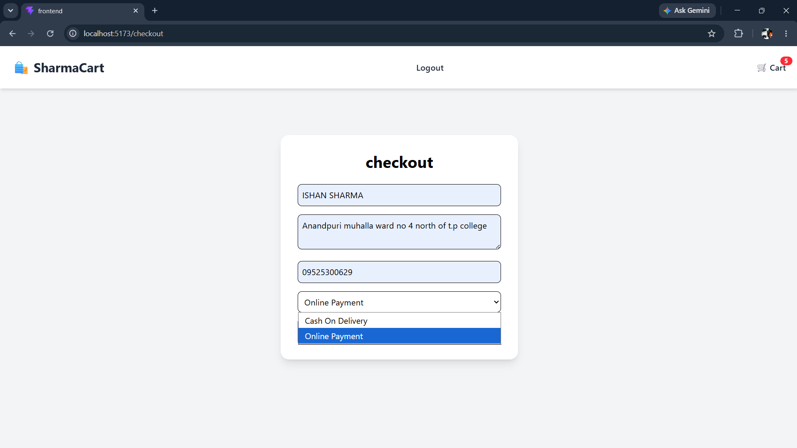
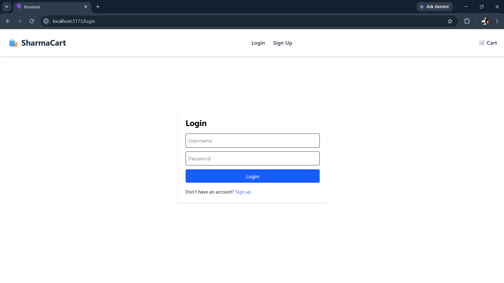
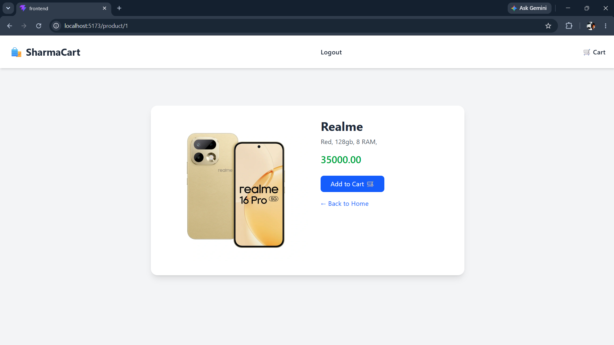
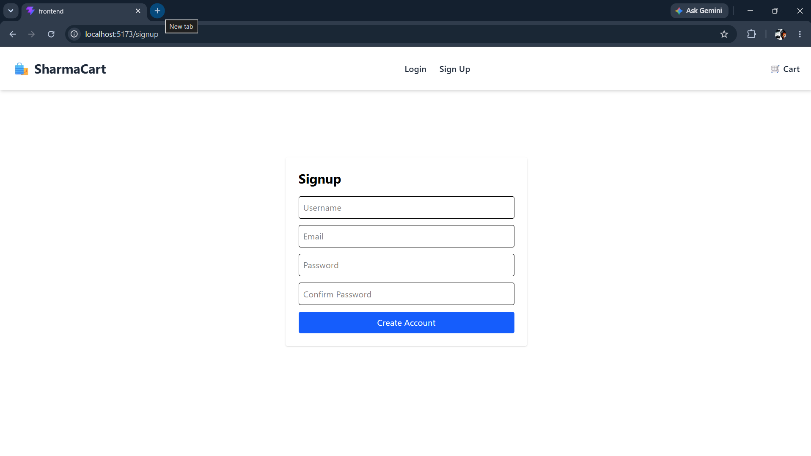

# E-Commerce Website

A full-stack E-Commerce web application built using React, Django, Django REST Framework, and SQL.

## Features

- User Registration & Login
- JWT Authentication
- Product Listing
- Product Details
- Shopping Cart
- Checkout
- Responsive Design

## Tech Stack

### Frontend
- React
- JavaScript
- HTML
- CSS
- Vite

### Backend
- Django
- Django REST Framework
- JWT Authentication

### Database
- SQL

## Screenshots

### Home Page

### Cart Page

### Checkout Page

### Login Page

### Product Page

### Signup Page

